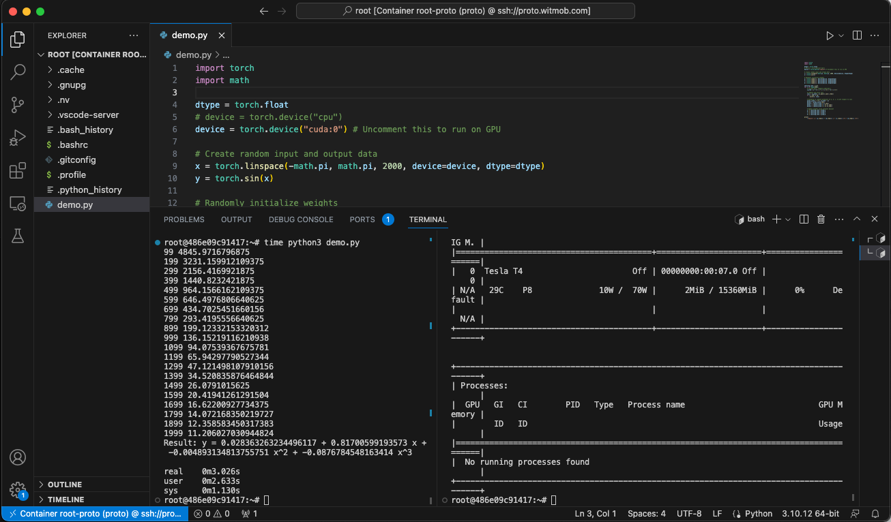

# Pytorch VM Proto

一个命令工具，可一健生成公有云（目前是阿里云）临时 vm，配置 gpu 和开发环境。

用于临时性的 `pytorch` 代码测试。

经济性好，使用竞价/抢占的付费方式，平均 1 小时小于 `¥0.4` (新加坡 nvidia t4/16GB)

使用方式是：

- 启动镜像实例
- vscode ssh remote & docker ext 使用




## 创建镜像

设置环境变量，terraform 和脚本需要相关变量访问云端服务：

```bash
# ~/.zshrc

# 阿里云
export ALICLOUD_ACCESS_KEY=xxxxx
export ALICLOUD_SECRET_KEY=xxxxx
# export ALICLOUD_REGION="cn-beijing"

# dnspod
export DNSPOD_ID=1111
export DNSPOD_TOKEN=xxxx
export DNSPOD_LOGIN_TOKEN=xxxx
```

创建 vm:

```bash
# 复制项目
git clone https://github.com/MarshalW/pytorch-vm-proto.git
cd pytorch-vm-proto

# 设置自己的域名和子域名
cp env.sh.example env.sh

# 创建带 gpu 支持的 vm
./apply.sh

# 测试能否正常访问
ssh root@your.domain.com

# 本地相关文件同步到服务器
./sync.sh
```

在 vm 中安装：

```bash

# 更新系统
apt update && apt upgrade -y

# 安装驱动 535
ubuntu-drivers autoinstall

# 需要重启
reboot

# 测试驱动是否有效
nvidia-smi

# 安装 docker
curl -fsSL https://get.docker.com -o get-docker.sh
sh get-docker.sh

# 安装 nvidia container toolkit
curl -fsSL https://nvidia.github.io/libnvidia-container/gpgkey | gpg --dearmor -o /usr/share/keyrings/nvidia-container-toolkit-keyring.gpg \
  && curl -s -L https://nvidia.github.io/libnvidia-container/stable/deb/nvidia-container-toolkit.list | \
    sed 's#deb https://#deb [signed-by=/usr/share/keyrings/nvidia-container-toolkit-keyring.gpg] https://#g' | \
    tee /etc/apt/sources.list.d/nvidia-container-toolkit.list \
  && \
    apt-get update
apt-get install nvidia-container-toolkit -qq -y
systemctl restart docker

# 构建带 pytorch 的 docker 镜像并启动
docker compose up -d

# 进入容器测试是否可用
docker exec -it proto bash
```

将当前 vm 实例生成镜像。

将生成的镜像 id 设置到 `./terraform/alicloud/main.tf`:

```bash
resource "alicloud_instance" "proto" {
  ..
  system_disk_size = 40
  image_id         = "xxxx"
  # image_id         = "ubuntu_22_04_x64_20G_alibase_20230815.vhd"
```

## 使用

```bash
# 启动生成好的镜像实例
./apply.sh

# 参考 https://stackoverflow.com/a/76847953
# 设置 vscode 访问远程 docker 容器
# 基本思路是 voscode ssh remote 访问 vm
# 再通过 docker 插件找到该容器，attach 容器到 vscode

# 使用完毕，销毁 vm
./destroy.sh
```